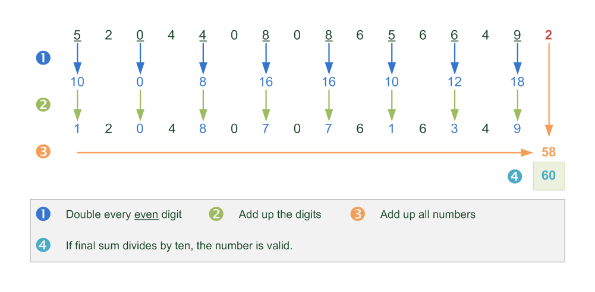
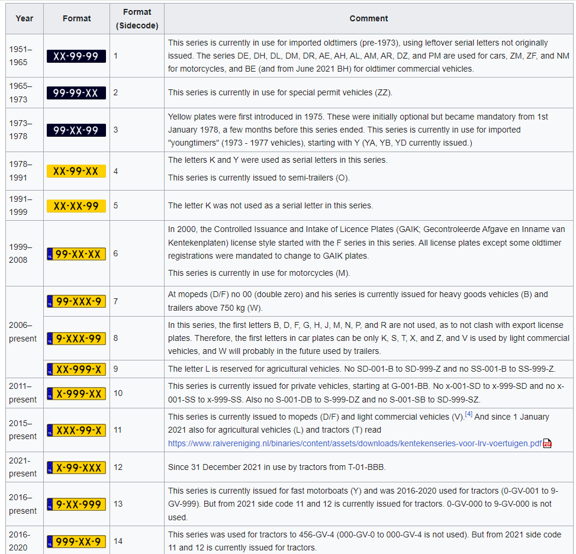

# Multi format data generator

## Introduction
This code generates random number with specific formats, and can include ASCII characters aswell. The platform consists of different modules like data masking, synthetic data generation, data subsetting and a centralized test data portal. For this project we propose a solution to develop a JAVA generator that returns a stream of unique numbers that can have various format requirements. 

Important to note that the view is not working yet. 

## Goal
Developing a synthetic data generator that can generate thousands of unique values per second with
different format requirements. As an addition, a generic user interface could be build inside a C#
application that could provide a method to define the unique number requirements

## Specification
JAVA generator that can generate a stream of unique keys with different requirements and formats.

It should implement the Java interface `com.datprof.generators.controller.generators.MainGenerator`.

### Example - Dutch BSN number

A Dutch BSN (BurgerServiceNummer) is valid when it complies to the following rules:

 * It only contains digits.
 * The length should be either 8 or 9 in length.
 * When the digits are indexed as A through I, the result of the following sum: 
   9xA + 8xB + 7xC + 6xD + 5xE + 4xF + 3xG + 2xH - I should be divisible by 11, and should not be 0.

Exactly 90 million numbers can be created with this combination. Per first digit there are 9090909 valid 
possibilities except first digit 0 (8181818 possibilities) and first digit 5 (9090910 possibilities).

Valid examples are: 111222333 and 123456782.

### Example - Belgian SSN (Belgisch Rijksregisternummer)

The identification number contains 11 digits

An initial group of six digits formed by the date of birth in the following order: year, month, day. 
Month and/or day can be zero if the exact date of birth is not known. If the person is not registered in the 
National Register, but data must still be kept for social security purposes, for example foreign employees who 
have been staying in Belgium for less than three months or cross-border workers, a bis number will be assigned.
With the bisnummer, the month of birth is increased by 20 or 40. If the gender is known at the time of 
application, the month of birth is increased by 40, otherwise it is increased by 20. If the person is a refugee
and the date of birth is not known, the month of birth is set to 00 and the date of birth set to 00.

A second group of three digits serves to identify persons born on the same day. This sequence number is even 
for a woman and odd for a man. It is the day counter of births. For a man from 001 to 997 and for a woman 
from 002 to 998.

A third group of two digits is a check digit based on the previous 9 digits. This is calculated by dividing the 
nine-digit number formed by concatenating the date of birth and serial number by 97. The remainder of this 
division ("modulo") is subtracted from 97. The difference thus obtained is the control number. For persons born 
in or after 2000, put a 2 before the nine-digit number (+2000000000) before dividing by 97.

Example: If a man was born on February 1, 1990, then a possible number is 90.02.01-997-04. After all, 900201997 
divided by 97 is 9280432+93. The difference of 97 and the remainder yields 97 - 93 = 04.

### Example - Luhn Number / Mod 10

A valid luhn number contains a check digit to validate its number. To calculate a Luhn number, you can use the 
following logic

### Example - Dutch Vehicle License Plate

Dutch license plates can be formatted as follows:

 
Nowadays, the letters used do not include vowels, to avoid profane or obscene language. To avoid confusion with 
a zero, the letters C and Q are also omitted and letters M and W are not used because they are too wide. 
Letters and numbers are issued in strict alphabetical/numeric order. Thus a Dutch license plate indicates the 
date of registration of a car, but no information about where in the country the car comes from, or to whom 
it belongs.

https://en.wikipedia.org/wiki/Vehicle_registration_plates_of_the_Netherlands	

## Notes

Example Java libraries implementing some kind of expression evaluator (to use or to get inspiration from):

 - https://www.janino.net/use.html#expression_evaluator
 - https://commons.apache.org/proper/commons-jexl/
 - https://sourceforge.net/projects/mxparser/
 - https://mathparser.org/
 - https://juel.sourceforge.net/

