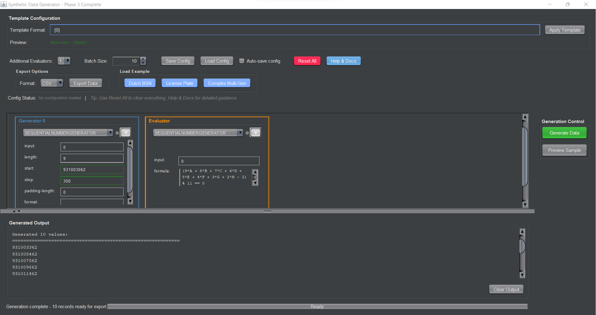

# Multi format data generator

- [Introduction](#introduction)
- [Goal](#goal)
- [Specification](#specification)
- [View Architecture](#view-architecture)
  - [Overview](#overview)
  - [Architectural Layers](#architectural-layers)
  - [Component Communication Flow](#component-communication-flow)
  - [Key Architectural Patterns](#key-architectural-patterns)
  - [Data Flow Architecture](#data-flow-architecture)
  - [Error Handling Strategy](#error-handling-strategy)
  - [Performance Optimizations](#performance-optimizations)
  - [Testing Strategy](#testing-strategy)
  - [Extension Points](#extension-points)
  - [Architecture Benefits](#architecture-benefits)
  - [Migration Path](#migration-path)
- [Backend Data Generation Architecture](#backend-data-generation-architecture)
  - [Overview](#overview-1)
  - [Core Architecture Components](#core-architecture-components)
  - [Data Flow Pipeline](#data-flow-pipeline)
  - [Generator Types Deep Dive](#generator-types-deep-dive)
  - [Template System & Formatting](#template-system--formatting)
  - [Advanced Features](#advanced-features)
  - [Performance Characteristics](#performance-characteristics)
  - [Error Handling & Validation](#error-handling--validation)
  - [Extension Architecture](#extension-architecture)
  - [Backend Architecture Benefits](#backend-architecture-benefits)
- [User Interface Instructions](#user-interface-instructions)
  - [Introduction](#introduction-1)
  - [Using the UI](#using-the-ui)
  - [Generators and Properties](#generators-and-properties)
  - [Additional Evaluators](#additional-evaluators)
  - [Example Configurations](#example-configurations)
- [Notes](#notes)
- [Troubleshooting](#troubleshooting)

## Introduction
This code generates random numbers with specific formats, and can include ASCII characters as well. The platform consists of different modules like data masking, synthetic data generation, data subsetting, and a centralized test data portal. For this project, we propose a solution to develop a JAVA generator that returns a stream of unique numbers that can have various format requirements.




## Goal
Developing a synthetic data generator that can generate thousands of unique values per second with different format requirements. As an addition, a generic user interface could be built inside a C# application that could provide a method to define the unique number requirements.

## Specification
JAVA generator that can generate a stream of unique keys with different requirements and formats.

It should implement the Java interface `com.controller.generators.MainGenerator`.

### [Current Examples and Descriptions]

## View Architecture

### Overview

The Multi-Format Data Generator follows a clean, modular architecture designed around the **Model-View-Controller (MVC)** pattern with additional **helper layers** for enhanced separation of concerns. This architecture prioritizes maintainability, testability, and extensibility through well-defined component boundaries and dependency injection.

### Architectural Layers

#### 🎯 **Layer 1: UI Foundations**
**Purpose**: Core UI utilities and styling infrastructure

##### Components:
- **`UIConstants`**: Centralized repository for all UI constants (colors, fonts, dimensions, spacing)
- **`UIComponentFactory`**: Factory for creating consistently styled UI components
- **`UIThemeManager`**: Handles application theming and dark mode support
- **`UILayoutManager`**: Manages complex layouts and responsive design
- **`StatusUpdateManager`**: Coordinates status updates across UI components

##### Key Responsibilities:
- Provide consistent styling across the application
- Abstract component creation with pre-applied themes
- Manage application-wide visual settings
- Handle responsive layout calculations

---

#### 🧠 **Layer 2: Business Logic Controllers**
**Purpose**: Core business logic separated from UI concerns

##### Components:
- **`GeneratorController`**: Orchestrates data generation processes
- **`ValidationController`**: Handles all validation logic with detailed error reporting
- **`ConfigurationManager`**: Manages configuration persistence and loading
- **`DataExportManager`**: Handles data export in multiple formats
- **`ExampleLoader`**: Manages pre-built configuration examples

##### Key Responsibilities:
- Execute core business operations without UI dependencies
- Provide async operations for non-blocking UI
- Maintain data integrity through comprehensive validation
- Handle file I/O operations securely

---

#### 🎭 **Layer 3: UI Helpers & Event Coordination**
**Purpose**: Bridge between UI and business logic, handle complex UI behaviors

##### Components:
- **`UIEventHandler`**: Central event coordinator for all UI interactions
- **`PreviewGenerator`**: Real-time preview generation with debouncing
- **`DocumentationManager`**: Context-sensitive help and documentation
- **`GeneratorPanelManager`**: Dynamic panel creation and management

##### Key Responsibilities:
- Coordinate communication between UI components and controllers
- Manage complex UI state transitions
- Provide real-time feedback and previews
- Handle asynchronous UI updates

---

#### 🖼️ **Layer 4: View Components (UI Layer)**
**Purpose**: Pure UI components with minimal business logic

##### Components:
- **`GeneratorUI`**: Main application window (dramatically simplified)
- **`GeneratorPanel`**: Dynamic generator configuration panels
- Various utility UI components

##### Key Responsibilities:
- Render user interface elements
- Capture user input
- Display data and feedback
- Coordinate visual layout

---

### Component Communication Flow

#### 📡 **Event-Driven Architecture**

The application uses a centralized event system coordinated by `UIEventHandler`:

```
User Interaction → UIEventHandler → Business Controllers → UI Updates
```

##### Event Flow Example:
1. **User clicks "Generate"** → `GeneratorUI` captures event
2. **Event delegation** → `UIEventHandler.createGenerateListener()`
3. **Business logic** → `GeneratorController.generateNumbersAsync()`
4. **Status updates** → Events fired to update progress bars, status labels
5. **Result display** → UI components updated with generated data

#### 🔄 **Dependency Injection Pattern**

Controllers are injected into helpers, ensuring loose coupling:

```java
// In GeneratorUI constructor:
GeneratorController generatorController = new GeneratorController();
ValidationController validationController = new ValidationController();

UIEventHandler eventHandler = new UIEventHandler(
    generatorController, validationController, 
    configurationManager, exportManager, exampleLoader
);

PreviewGenerator previewGenerator = new PreviewGenerator(
    generatorController, validationController
);
```

#### 🎯 **Separation of Concerns**

Each layer has distinct responsibilities:

| Layer | Knows About | Doesn't Know About |
|-------|-------------|-------------------|
| **UI Foundations** | Styling, theming, component creation | Business logic, data models |
| **Business Controllers** | Core logic, data processing | UI components, visual styling |
| **UI Helpers** | Both UI and business layers | Internal controller implementation |
| **View Components** | UI state, user interactions | Business logic implementation |

---

### Key Architectural Patterns

#### 🏭 **Factory Pattern**
`UIComponentFactory` creates consistently styled components:

```java
// Instead of: new JButton("Generate")
JButton generateBtn = UIComponentFactory.createPrimaryButton("Generate");
```

#### 🎯 **Observer Pattern**
Event-driven updates through `UIEventHandler`:

```java
eventHandler.addEventListener(EventType.GENERATION_COMPLETED, 
    eventData -> updateProgressBar(100));
```

#### 🔧 **Strategy Pattern**
`PreviewGenerator` supports multiple update modes:

```java
previewGenerator.setUpdateMode(UpdateMode.DEBOUNCED);
previewGenerator.setDebounceDelay(500);
```

#### 📋 **Builder Pattern**
Complex configurations built incrementally:

```java
GeneratorConfiguration config = configurationManager
    .createConfigurationFromTemplate(template, generatorCount);
```

---

### Data Flow Architecture

#### 📥 **Input Processing**
1. **Template Input** → `ValidationController.validateTemplateFormat()`
2. **Configuration Creation** → `ConfigurationManager.createConfigurationFromTemplate()`
3. **Panel Generation** → `GeneratorPanelManager.setupGeneratorsBasedOnTemplate()`

#### ⚙️ **Generation Process**
1. **Validation** → All inputs validated before processing
2. **Async Generation** → `GeneratorController.generateNumbersAsync()`
3. **Progress Updates** → Real-time UI updates via events
4. **Result Display** → Formatted output in UI components

#### 📤 **Output Management**
1. **Preview Generation** → Real-time preview updates as user types
2. **Batch Generation** → Large-scale data generation with progress tracking
3. **Export Processing** → Multiple format support with async operations

---

### Error Handling Strategy

#### 🛡️ **Layered Error Handling**

1. **Validation Layer** (Prevention)
   - Input validation with detailed error messages
   - Configuration validation before processing
   - Template syntax checking

2. **Business Layer** (Graceful Degradation)
   - Exception handling in controllers
   - Fallback mechanisms for failed operations
   - Retry logic for transient failures

3. **UI Layer** (User Communication)
   - Error display in status messages
   - Visual feedback for validation errors
   - Progress indication for long operations

#### 📊 **Validation Result Pattern**

```java
ValidationResult result = validationController.validateTemplateFormat(template);
if (!result.isValid()) {
    displayErrors(result.getErrors());
    showWarnings(result.getWarnings());
    return;
}
---

## Backend Data Generation Architecture

### Overview

The backend data generation system follows a **multi-layered pipeline architecture** where data flows through specialized components that transform, validate, and format the output. The system is designed around the concept of **composable generators** that can be chained together to create complex data patterns.

### Core Architecture Components

#### 🏭 **Factory & Builder Layer**
**Purpose**: Convert user configuration into executable generator instances

##### Components:
- **`InputProcessor`**: Main factory that converts user input into generator and pattern instances
- **`GeneratorConfiguration`**: Data model representing the complete generator setup
- **Pattern Factories**: Create specific pattern instances based on generator types

##### Key Responsibilities:
- Parse user configuration into strongly-typed objects
- Instantiate appropriate generator and pattern combinations
- Validate configuration completeness before pipeline creation

---

#### 🔄 **Pipeline Orchestration Layer**
**Purpose**: Coordinate the data generation workflow

##### Components:
- **`MainGenerator`**: Central orchestrator implementing the `IGenerator` interface
- **`Template`**: Contains formatting rules and generator coordination logic
- **`Formatter`**: Handles complex string formatting with nested patterns

##### Key Responsibilities:
- Coordinate execution order of multiple sub-generators
- Handle dependencies between generators (e.g., evaluators depending on number generators)
- Apply template formatting to combine multiple generator outputs
- Manage generation retry logic for validation failures

---

#### ⚙️ **Data Generation Layer**
**Purpose**: Generate raw data according to specific algorithms

##### Generator Types:

**Sequential Generators:**
- **`SequentialNumberGenerator`**: Produces incremental number sequences
- **`SequentialASCIIGenerator`**: Produces character sequences from custom alphabets

**Processing Tools:**
- **`Calculator`**: Applies mathematical formulas to transform input data
- **`Evaluator`**: Filters data based on validation formulas (acts as a gate)

##### Key Responsibilities:
- Generate data according to specific mathematical or logical rules
- Maintain internal state for sequential generation
- Handle overflow conditions and boundary cases
- Apply custom formatting to individual values

---

#### 📋 **Pattern Definition Layer**
**Purpose**: Define the behavior and constraints for each generator

##### Pattern Types:
- **`SequentialPattern`**: Configuration for number/ASCII sequence generation
- **`ToolPattern`**: Configuration for calculators and evaluators
- **Base `Pattern`**: Common properties like format strings, length constraints, input dependencies

##### Key Responsibilities:
- Store generator-specific configuration parameters
- Validate configuration completeness and consistency
- Provide type-safe access to generator properties
- Handle default values and optional parameters

---

### Data Flow Pipeline

#### 🚀 **Generation Workflow**

```
User Input → InputProcessor → MainGenerator → SubGenerators → Formatter → Output
```

##### Step-by-Step Process:

1. **Configuration Phase**
   ```java
   InputProcessor processor = new InputProcessor(templateFormat);
   processor.addGeneratorAndPattern("SEQUENTIALNUMBERGENERATOR", properties);
   processor.addGeneratorAndPattern("EVALUATION", evaluatorProperties);
   
   Template template = processor.initTemplate();
   MainGenerator generator = processor.initMainGenerator();
   ```

2. **Generation Phase**
   ```java
   Stream<String> results = generator.generate();
   // Each call to the stream produces one formatted result
   ```

3. **Internal Iteration Process** (for each generated value):
   - **Initialize**: Start with initial values from patterns
   - **Generate**: Execute each sub-generator in dependency order
   - **Validate**: Check length constraints and evaluator conditions
   - **Retry**: If validation fails, retry up to 1000 times
   - **Format**: Apply template formatting to combine all values
   - **Output**: Return formatted string result

#### 🔄 **Dependency Resolution**

Generators can depend on outputs from other generators:

```java
// Generator 0: Sequential Number (independent)
properties.put("input", "0"); // Self-referencing

// Generator 1: Calculator (depends on Generator 0)
properties.put("input", "0"); // Takes output from generator 0
properties.put("formula", "A+B+C"); // Process the digits

// Generator 2: Evaluator (filters Generator 0)
properties.put("input", "0"); // Validates generator 0 output
properties.put("formula", "A%2==0"); // Only even numbers pass
```

---

### Generator Types Deep Dive

#### 🔢 **Sequential Number Generator**

**Purpose**: Generate incremental number sequences with formatting

**Algorithm**:
```java
public String generate(String pastValue) {
    Long value = parseLong(pastValue);
    Long nextValue = value + step;
    
    // Check bounds
    if (nextValue < Math.pow(10, length)) {
        return paddingFunction.apply(nextValue);
    }
    return null; // Overflow, triggers retry
}
```

**Key Features**:
- **Configurable Step**: Increment by any positive/negative value
- **Length Constraints**: Enforces maximum digit count
- **Padding**: Zero-padding for consistent length
- **Overflow Detection**: Prevents invalid numbers

**Configuration Example**:
```java
Map<String, String> properties = Map.of(
    "length", "5",        // 5-digit numbers
    "start", "10000",     // Start at 10000
    "step", "7",          // Increment by 7
    "padding-length", "5" // Zero-pad to 5 digits
);
```

#### 🔤 **Sequential ASCII Generator**

**Purpose**: Generate sequences using custom character alphabets

**Algorithm**:
```java
public String generate(String pastValue) {
    // Convert string to list of character indices
    List<Integer> indices = stringToIndices(pastValue);
    
    // Increment like a number in custom base
    if (indices.equals(maxIndices)) {
        indices = minIndices; // Wrap around
    } else {
        indices = incrementList(indices); // Base-n increment
    }
    
    // Convert back to string
    return indicesToString(indices);
}
```

**Key Features**:
- **Custom Alphabets**: Use any character set (a,b,c or 0,1,2,3,4, etc.)
- **Base-N Arithmetic**: Increments in the base of the alphabet size
- **Wraparound**: Cycles back to start when maximum reached
- **Variable Length**: Supports multi-character sequences

**Configuration Example**:
```java
Map<String, String> properties = Map.of(
    "list", "A,B,C,D",     // Custom 4-character alphabet
    "length", "3",         // 3-character sequences
    "start", "AAA"         // Start sequence
);
// Generates: AAA, AAB, AAC, AAD, ABA, ABB, ...
```

#### 🧮 **Calculator Tool**

**Purpose**: Apply mathematical formulas to transform input data

**Algorithm**:
```java
public String generate(String values) {
    // Map each digit to a letter variable
    // Input: "123" → A=1, B=2, C=3
    Map<Character, Integer> variables = initializeNumberMap(values);
    
    // Replace formula variables with actual values
    // Formula: "A+B*C" → "1+2*3"
    String expression = getExpression(values, formulaString);
    
    // Evaluate using Crunch expression evaluator
    CompiledExpression compiled = Crunch.compileExpression(expression);
    double result = compiled.evaluate();
    
    return String.valueOf((int) result);
}
```

**Key Features**:
- **Variable Mapping**: Each input digit becomes a formula variable (A, B, C, ...)
- **Mathematical Expressions**: Supports +, -, *, /, %, parentheses, etc.
- **External Library**: Uses Crunch library for safe expression evaluation
- **Type Conversion**: Converts results back to integers/strings

**Configuration Example**:
```java
Map<String, String> properties = Map.of(
    "input", "0",              // Take input from generator 0
    "formula", "(A+B+C)%10"   // Sum digits, modulo 10
);
// Input: "456" → A=4, B=5, C=6 → (4+5+6)%10 = 5
```

#### ✅ **Evaluator Tool**

**Purpose**: Filter generated data based on validation conditions

**Algorithm**:
```java
public String generate(String values) {
    // Same variable mapping as Calculator
    String expression = getExpression(values, formulaString);
    
    // Evaluate boolean expression
    double result = compiled.evaluate();
    
    // Return original value if condition is true, null otherwise
    return (int) result == 1 ? values : null;
}
```

**Key Features**:
- **Boolean Logic**: Supports comparison operators (==, !=, <, >, <=, >=)
- **Logical Operators**: AND, OR, NOT operations
- **Filtering**: Acts as a gate - passes valid values, blocks invalid ones
- **Retry Trigger**: Null return triggers MainGenerator to retry

**Configuration Example**:
```java
Map<String, String> properties = Map.of(
    "input", "0",                           // Validate generator 0 output
    "formula", "(A+B+C+D+E+F+G+H*9-I)%11==0" // Dutch BSN validation
);
// Only numbers passing the BSN checksum will be output
```

---

### Template System & Formatting

#### 🎨 **Multi-Level Formatting**

The system supports two levels of formatting:

1. **Generator-Level Formatting**: Applied to individual generator outputs
2. **Template-Level Formatting**: Combines multiple generator outputs

##### Example: Complex ID Generation
```java
// Template: "{0}-{1}-{2}"
// Generator 0: Sequential numbers with format "{1}{2}-{3}"
// Generator 1: Calculator with format "CHK{1}"
// Generator 2: ASCII sequence

// Result: "45-6-CHK7-ABC"
```

#### 🔗 **Template Processing**

**Algorithm**:
```java
public String format(List<String> values) {
    // First: Apply individual generator formatting
    List<String> formattedValues = formatValuesList(values);
    
    // Second: Apply template formatting
    StringBuilder result = new StringBuilder();
    for (char c : templateFormat.toCharArray()) {
        if (c == '{') {
            int generatorIndex = getNextDigit();
            result.append(formattedValues.get(generatorIndex));
        } else {
            result.append(c);
        }
    }
    return result.toString();
}
```

**Key Features**:
- **Placeholder Substitution**: `{0}`, `{1}`, `{2}` replaced with generator outputs
- **Nested Formatting**: Generators can have their own format strings
- **Literal Text**: Non-placeholder characters included as-is
- **Error Handling**: Invalid placeholders cause generation failure

---

### Advanced Features

#### 🔗 **Dependency Chain Management**

Generators execute in dependency order:

```java
private boolean iterate() {
    for (Entry<Integer, ISubGenerator> entry : subGenerators.entrySet()) {
        Integer index = entry.getKey();
        ISubGenerator generator = entry.getValue();
        
        // Get input from dependency (could be self-reference)
        String input = getInput(index);
        
        // Generate new value
        String value = generator.generate(input);
        if (value == null) return false; // Validation failed
        
        // Store for next generators
        values.put(index, value);
    }
    return true;
}
```

**Features**:
- **Automatic Resolution**: Dependencies resolved by index mapping
- **Self-Reference**: Generators can reference their own previous output
- **Cross-Reference**: Generators can use outputs from any other generator
- **Validation Propagation**: Failed validation stops the entire iteration

---

### Performance Characteristics

#### ⚡ **Streaming Architecture**

```java
public Stream<String> generate() {
    return Stream.generate(this::generateNextValue);
}
```

**Benefits**:
- **Lazy Evaluation**: Values generated on-demand
- **Memory Efficient**: No pre-computation or storage of large datasets
- **Infinite Streams**: Can generate unlimited sequences
- **Backpressure**: Consumers control generation rate

#### 🎯 **Optimization Strategies**

1. **Pre-compiled Functions**: Padding functions created once during initialization
2. **Expression Caching**: Mathematical expressions compiled once and reused
3. **Minimal Object Creation**: Reuse of maps and collections where possible
4. **Early Validation**: Quick failure detection to minimize retry overhead

---

### Error Handling & Validation

#### 🛡️ **Multi-Layer Validation**

1. **Configuration Validation** (Build-time)
   ```java
   // Pattern constructors validate required properties
   if (!properties.containsKey("start")) {
       throw new IllegalArgumentException("No starting value specified");
   }
   ```

2. **Runtime Validation** (Generation-time)
   ```java
   // Length constraints checked during generation
   if (value.length() != wantedLength) return false;
   ```

3. **Formula Validation** (Expression-time)
   ```java
   // Expression evaluator handles syntax errors
   try {
       CompiledExpression expr = Crunch.compileExpression(expression);
   } catch (Exception e) {
       throw new IllegalArgumentException("Invalid formula");
   }
   ```

#### 🔄 **Graceful Degradation**

- **Null Propagation**: Invalid generations return null, triggering retry
- **Bounded Retries**: Maximum attempt limit prevents infinite loops
- **Clear Error Messages**: Specific error types with descriptive messages
- **State Preservation**: Generator state maintained across failed attempts

---

### Extension Architecture

#### 🔌 **Adding New Generator Types**

1. **Create Pattern Class**:
   ```java
   public class CustomPattern implements IPattern {
       // Define configuration properties
   }
   ```

2. **Create Generator Class**:
   ```java
   public class CustomGenerator extends SubGenerator implements ISubGenerator {
       public String generate(String pastValue) {
           // Implement generation logic
       }
   }
   ```

3. **Register in InputProcessor**:
   ```java
   case "CUSTOMGENERATOR":
       CustomPattern pattern = new CustomPattern(properties);
       CustomGenerator generator = new CustomGenerator(pattern);
       // Add to maps
       break;
   ```

#### 🌐 **Formula System Extensions**

The formula system uses the **Crunch** expression evaluator, which supports:
- Custom functions and operators
- Variable injection
- Mathematical and logical operations
- Safe evaluation (no code execution)

---

### Backend Architecture Benefits

#### ✅ **Modularity**
- **Composable**: Generators can be combined in any configuration
- **Reusable**: Same generator types used in different contexts
- **Extensible**: New generator types added without changing existing code

#### ✅ **Performance**
- **Streaming**: Memory-efficient lazy evaluation
- **Compiled**: Mathematical expressions pre-compiled for speed
- **Stateful**: Minimal computation per generation cycle

#### ✅ **Reliability**
- **Validated**: Multi-layer validation prevents runtime errors
- **Bounded**: Retry limits prevent infinite loops
- **Typed**: Strong typing prevents configuration errors

#### ✅ **Flexibility**
- **Dependency Chains**: Complex generator interdependencies
- **Formula-Driven**: Mathematical and logical expressions for custom logic
- **Multi-Format**: Support for numbers, ASCII, and computed values

This backend architecture provides a robust foundation for generating complex, validated data patterns while maintaining high performance and extensibility.

## User Interface Instructions

### Introduction
The Synthetic Data Generator UI provides a user-friendly interface to generate data according to various specifications. It features a dynamic form that allows users to configure different types of generators, each with specific properties.

### Using the UI
1. **Template Format:** Begin by entering a template format in the provided field. This format should outline the structure of your desired output, using placeholders like `{0}`, `{1}`, etc., to indicate where generated values will be inserted.
2. **Generator Configuration:** Based on the template format, input fields for each generator will appear. Select the type of generator from the dropdown and fill in the properties required for that generator.
3. **Generate:** Once all generators are configured, press the "Generate" button to produce the output.
4. **Clear Output:** If you need to clear the output area, use the "Clear Output" button.

### Generators and Properties
Each generator type has specific properties:

- **Sequential Number Generator:**
  - `length`: The number of digits in the generated sequence.
  - `start`: The starting number of the sequence.
  - `step`: The increment between each number in the sequence.
  - `padding-length`: Ensures the generated number has a fixed length by adding leading zeros if necessary.
  - `format`: The specific format to apply to the generated number, e.g., `XX-{0}-XX`.

- **Calculation:**
  - `input`: The index of another generator whose output will be used as input for this generator.
  - `formula`: A mathematical expression used to calculate the generated value.
  - `length`: The length of the generated calculation output.
  - `format`: The format in which the calculated value will be output.

- **Sequential ASCII Generator:**
  - `list`: A comma-separated list of characters to be used in generating sequences.
  - `length`, `start`, `step`, `padding-length`, and `format` properties similar to the Sequential Number Generator.

- **Evaluation:**
  - `input`: Similar to Calculation, specifies the dependency on another generator.
  - `formula`: A logical expression to evaluate the truthiness of generated values. Only values that satisfy the formula will be output.

### Additional Evaluators
You can add additional evaluator generators that do not contribute directly to the output format but are used to filter values based on logical conditions.

### Example Configurations
Below are detailed instructions for setting up generators based on the integration tests provided earlier.

#### Dutch BSN Number Generator Setup
1. **Template Format:** Enter `{0}` in the template format field.
2. **Generator Configuration:**
   - For `SEQUENTIALNUMBERGENERATOR`:
     - `length`: "9"
     - `start`: "100000000"
     - `step`: "1"
     - `padding-length`: "0"
     - `input`: "0"
   - For `EVALUATION`:
     - `formula`: "(9*A + 8*B + 7*C + 6*D + 5*E + 4*F + 3*G + 2*H - I) % 11 == 0"
     - `input`: "0"
3. **Generate:** Click "Generate" to produce valid BSN numbers.

#### Full Generator Process Setup
1. **Template Format:** Enter `{0}--{1}--{2}` in the template format field.
2. **Generator Configuration:**
   - For `SEQUENTIALNUMBERGENERATOR`:
     - `length`: "3"
     - `start`: "100"
     - `step`: "1"
     - `padding-length`: "3"
     - `format`: "{1}{2}-{3}"
     - `input`: "0"
   - For `CALCULATION`:
     - `formula`: "A+B+C"
     - `input`: "0"
     - `length`: "2"
     - `format`: "{1}{2}AAA"
   - For `EVALUATION`:
     - `formula`: "A%2==0"
     - `input`: "0"
     - `length`: "3"
   - For `SEQUENTIALASCIIGENERATOR`:
     - `list`: "a,b,c"
     - `length`: "3"
     - `start`: "aaa"
     - `padding-length`: "3"
     - `format`: "{1}--{2}--{3}"
     - `input`: "3"
3. **Generate:** Click "Generate" to produce complex formatted sequences.

### Notes
- Remember to use the dropdown to select the number of additional evaluators required.
- The evaluator's properties are similar to those of the Calculation generator but are used to filter rather than format values.

Example Java libraries implementing some kind of expression evaluator (to use or to get inspiration from):

 - https://www.janino.net/use.html#expression_evaluator
 - https://commons.apache.org/proper/commons-jexl/
 - https://sourceforge.net/projects/mxparser/
 - https://mathparser.org/
 - https://juel.sourceforge.net/

### Troubleshooting
If you encounter any issues while using the UI, ensure all required properties are filled in and that the format string correctly matches the number of configured generators.

